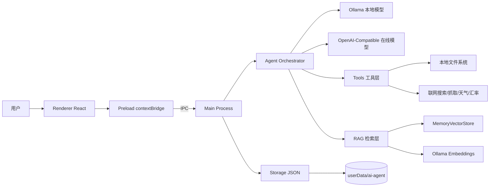

# AI Agent 技术架构设计（当前实现）

## 1. 文档说明

本文档基于当前代码实现重新生成，覆盖以下能力：

- Electron 桌面应用架构
- 本地与在线模型双通道
- 自动路由（普通对话 / Agent 工具 / RAG）
- 本地 Skills 配置与路由干预
- RAG 文档上传、索引、检索问答
- 会话与设置本地持久化

## 2. 高层架构

## 3. 技术栈

- 运行时：Electron 33
- 构建：electron-vite + Vite 5
- 前端：React 18 + TypeScript
- LLM 编排：LangChain
- 本地模型：Ollama（默认 http://localhost:11434）
- 在线模型：OpenAI-Compatible Chat Completions
- 向量检索：MemoryVectorStore + OllamaEmbeddings
- 文档解析：pdf-parse、mammoth
- 参数校验：zod
- 持久化：JSON 文件（Electron userData）

## 4. 目录与模块

- Main 进程
  - src/main/index.ts：IPC 路由、窗口管理、消息编排入口
  - src/main/agent.ts：模型调用与对话编排（chat / agent / rag）
  - src/main/openaiCompatible.ts：在线模型请求、流式、测试、余额
  - src/main/rag.ts：文档解析、切分、向量索引、相似检索
  - src/main/storage.ts：会话/模型设置/skills 存储
  - src/main/skills.ts：skills 匹配与提示词构造
  - src/main/tools/\*：文件、系统、网络工具

- 预加载层
  - src/preload/index.ts：contextBridge 暴露安全 API

- 渲染层
  - src/renderer/src/App.tsx：全局状态、聊天流程、设置中心
  - src/renderer/src/components/\*：Sidebar / ChatArea / InputBar / MessageBubble
  - src/renderer/src/types/conversation.ts：会话与消息类型

## 5. 核心能力设计

### 5.1 模型与路由

系统维护三条场景路由：

- chat：普通对话
- agent：复杂任务与工具调用
- rag：文档问答

每条路由都可独立配置：

- provider：ollama 或 openai-compatible
- model：该路由的模型名

自动路由策略位于 src/main/index.ts：

- 有 fileIds 时优先走 RAG
- 命中工具意图时走 Agent
- 复杂任务可走高级模型
- 其余走普通对话

### 5.2 实时问题处理

针对“今天是哪天/当前日期/星期几/现在几点”等实时问题：

- 单独意图识别 shouldUseRealtimeTool
- 强制优先进入工具路径
- 会隔离旧 history，避免历史上下文污染时间回答
- 系统提示词附带运行时当前时间参考，并要求必要时调用 get_current_time

### 5.3 Skills 本地配置

Skills 数据结构（存于 settings.json）：

- id, name, description
- keywords
- systemPrompt
- enabled
- preferredScene: auto/chat/agent/rag
- priority

匹配逻辑位于 src/main/skills.ts：

- 支持关键词匹配
- 支持显式技能名命中（例如 #技能名）
- 支持优先级排序
- 匹配后会注入技能提示词，并可影响路由场景

### 5.4 RAG 文档问答

RAG 流程位于 src/main/rag.ts + src/main/agent.ts：

1. 上传文件（txt/md/pdf/docx/csv/json/ts/js）
2. 文本抽取 + 切块（chunkSize 900 / overlap 150）
3. 使用 nomic-embed-text 生成向量
4. 存入 MemoryVectorStore（当前为内存索引）
5. 查询时按 fileIds 检索相关片段
6. 将片段拼接到系统上下文完成回答

RAG 上下文隔离：

- 前端消息带 ragContextId
- 切换文件集后生成新的 contextId
- 避免旧文件内容干扰新文件问答

### 5.5 工具体系

工具集合由 src/main/tools/index.ts 汇总，三类能力：

- 文件工具：read_file / write_file / list_directory / delete_file / search_files
- 系统工具：get_current_time / calculator / unit_convert / clipboard_copy
- 网络工具：web_search / fetch_url / get_weather_current / currency_convert

在线模型工具调用通过 openaiCompatible.ts 中的工具 schema 与本地工具执行结果回填实现。

### 5.6 在线模型通道

在线 provider 采用 OpenAI-Compatible 协议：

- 支持 baseUrl + apiKey + model
- 支持 API 测试（连通性、模型列表、耗时）
- 部分 provider 支持余额信息（如 OpenRouter credits）
- 支持在线预设保存、切换、删除

## 6. IPC 与事件

主要 IPC（Main <-> Renderer）：

- 聊天
  - chat:send
  - chat:abort
  - 事件：chat:token / chat:tool-call / chat:tool-result / chat:model-info / chat:done / chat:error

- 模型与设置
  - models:list / models:get-_ / models:set-_
  - settings:get-model-config
  - settings:save-model-config
  - settings:test-online

- Skills
  - skills:list
  - skills:save

- RAG
  - rag:pick-files
  - rag:list
  - rag:remove
  - 事件：rag:status

- 存储
  - storage:list / load / save / update-meta / delete
  - storage:get-active / storage:set-active

## 7. 持久化设计

存储根目录：

- <userData>/ai-agent

核心文件：

- index.json：会话元数据索引
- active.json：当前活跃会话 ID
- conversations/<id>.json：会话消息
- settings.json：模型路由、在线配置、skills

说明：

- 会话消息持久化包含工具轨迹、modelInfo、ragContextId
- RAG 向量索引当前不落盘，应用重启后需重新上传文档

## 8. 设置中心（Renderer）

设置弹窗已拆分为两个页签：

- 模型配置：场景路由、本地模型、在线 API 与预设、API Test
- Skills 配置：技能列表、启停、优先级、关键词、提示词、优先路由

滚动策略：

- 仅内容区滚动（modalBody）
- 头部与页签固定

## 9. 安全与边界

已启用：

- contextIsolation: true
- nodeIntegration: false
- 仅通过 preload 暴露受限 API
- 外链统一 shell.openExternal

待加强：

- 文件工具目录沙箱（当前可访问进程权限范围）
- 更细粒度的操作审计与风险拦截
- RAG 索引持久化与加密策略

## 10. 运行与构建

- 开发：npm run dev
- 调试主进程：npm run dev:inspect
- 类型检查：npm run typecheck
- 构建：npm run build

## 11. 已知限制

- RAG 索引在内存中，重启后失效
- 在线 provider 余额查询并非所有服务都支持
- 当前未引入统一日志中心与指标面板

## 12. 后续建议

- 增加向量索引落盘（按文件哈希增量更新）
- 增加工具权限策略（工作区 allowlist）
- 增加端到端回归用例（路由/工具/实时日期/RAG）
- 将 IPC 协议与类型提取为共享契约层
