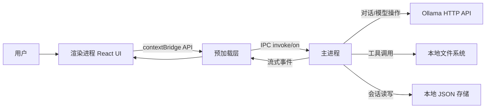

# AI Agent 技术架构设计

## 1. 目标与范围

本文档用于说明当前仓库中本地桌面 AI 助手的技术架构。
该项目是一个基于 Electron 的桌面应用，包含 React 渲染层、Electron 主进程编排层、本地文件工具能力和本地会话持久化能力。

## 2. 高层架构

## 3. 技术栈

- 桌面运行时：Electron 33
- 构建系统：electron-vite + Vite 5
- 前端：React 18 + TypeScript
- LLM 编排：LangChain（`@langchain/ollama`、`@langchain/core`）
- 本地模型服务：Ollama（HTTP `http://localhost:11434`）
- 参数校验：Zod（工具 schema）
- 本地持久化：Electron `userData` 目录下的 JSON 文件

参考文件：

- `package.json`
- `electron.vite.config.ts`

## 4. 功能能力矩阵

| 功能能力       | 用户可见行为                     | 主要实现                                                                                  |
| -------------- | -------------------------------- | ----------------------------------------------------------------------------------------- |
| 流式对话       | 助手内容按 token 实时返回        | `src/main/index.ts` 的 IPC `chat:send`；`src/main/agent.ts` 的 `chatStream`               |
| Agent 工具模式 | LLM 可调用文件工具并返回工具轨迹 | `src/main/agent.ts` 的 `chatWithAgent`；`src/main/tools/fileTools.ts`                     |
| 请求中断       | 停止当前生成                     | `src/main/index.ts` 的 IPC `chat:abort`；`AbortController`                                |
| 模型管理       | 获取/切换当前 Ollama 模型        | `src/main/index.ts` 的 `models:*`；`src/main/agent.ts` 的 `fetchOllamaModels`/`setModel`  |
| 会话持久化     | 历史列表、懒加载、保存与删除     | `src/main/storage.ts`；渲染层状态同步位于 `src/renderer/src/App.tsx`                      |
| 工具调用可视化 | 在聊天 UI 展示工具输入与结果     | IPC `chat:tool-call`、`chat:tool-result`；`src/renderer/src/components/MessageBubble.tsx` |

## 5. 进程职责划分

### 5.1 主进程

文件：`src/main/index.ts`

- 创建 `BrowserWindow`，并通过 `contextIsolation: true`、`nodeIntegration: false` 加固运行时配置。
- 注册聊天、模型、存储相关 IPC 处理器。
- 维护 `currentAbortController` 与 `currentWebContents`，用于取消请求和资源清理。

文件：`src/main/agent.ts`

- 管理模型生命周期（`currentModel`、`setModel`、`getModel`）。
- 将渲染层历史消息转换为 LangChain 消息结构。
- 提供两种对话模式：
  - `chatStream`：无工具调用的直接流式输出。
  - `chatWithAgent`：最多 5 轮工具调用循环，随后输出最终流式回复。
- 通过回调上报工具调用与工具结果，用于 UI 侧展示。

文件：`src/main/tools/fileTools.ts`

- 定义 5 个带 Zod schema 的 LangChain 工具：
  - `read_file`
  - `write_file`
  - `list_directory`
  - `delete_file`
  - `search_files`
- 暴露 `allTools`，供模型绑定使用。

文件：`src/main/storage.ts`

- 将会话元数据和消息持久化到 JSON 文件。
- 维护索引文件（`index.json`）、活跃会话（`active.json`）以及单会话消息文件（`conversations/<id>.json`）。

### 5.2 预加载层

文件：`src/preload/index.ts`

- 通过 `contextBridge` 暴露受限的 `electronAPI`。
- 提供 invoke 类接口（`sendMessage`、`listModels`、存储调用）和事件订阅（`onToken`、`onDone`、`onError`、工具事件）。
- 作为渲染层访问主进程特权能力的唯一桥接层。

### 5.3 渲染进程

文件：`src/renderer/src/App.tsx`

- 维护应用级状态：会话列表、当前会话、加载状态、模式开关、模型列表与当前模型。
- 启动时从本地存储恢复历史与上次活跃会话。
- 在切换会话时对消息进行懒加载。
- 管理发送生命周期：
  - 添加用户消息与流式助手占位消息。
  - 注册流式/工具/错误/完成事件监听。
  - 触发 IPC `sendMessage`。
  - 在完成或错误时收尾并持久化。

配套 UI 组件：

- `src/renderer/src/components/Sidebar.tsx`：会话切换/删除 + 模型选择。
- `src/renderer/src/components/InputBar.tsx`：输入、模式切换、发送/中断。
- `src/renderer/src/components/ChatArea.tsx`：欢迎态、滚动、加载态展示。
- `src/renderer/src/components/MessageBubble.tsx`：Markdown 渲染、代码高亮、工具轨迹展示。

## 6. 核心数据模型

渲染层领域模型（`src/renderer/src/types/conversation.ts`）：

- `Message`：角色与内容，附带可选工具轨迹、流式状态、错误状态。
- `Conversation`：元数据 + 内存消息 + 懒加载标记。
- 包含消息创建、标题生成、存储转换等辅助函数。

主进程/预加载共享存储模型（`src/main/storage.ts`、`src/preload/index.ts`）：

- `ConvMeta`：`id`、`title`、`createdAt`、`updatedAt`。
- `StoredMessage`：持久化消息，包含可选 `toolCalls`、`toolResults`、`isError`。

## 7. 运行时流程

### 7.1 流式聊天（不使用工具）

1. 渲染层调用 `electronAPI.sendMessage(history, message, false)`。
2. 主进程在 IPC `chat:send` 中调用 `chatStream`。
3. `chatStream` 通过 LangChain 从 Ollama 流式获取 token。
4. 主进程持续发送 `chat:token`，结束后发送 `chat:done`。
5. 渲染层完成助手消息并持久化会话。

### 7.2 Agent 聊天（启用工具）

1. 渲染层调用 `electronAPI.sendMessage(history, message, true)`。
2. 主进程调用 `chatWithAgent`。
3. 模型返回中可能包含 `tool_calls`。
4. 对每次工具调用：
   - 主进程发送 `chat:tool-call`。
   - 执行 `allTools` 中匹配工具。
   - 发送 `chat:tool-result`。
   - 将工具结果追加回模型上下文。
5. 当不再需要工具时，主进程输出最终流式回复（`chat:token`），并发送 `chat:done`。

### 7.3 中断流程

1. 渲染层发送 `chat:abort`。
2. 主进程主动发送 `chat:done` 并中止当前 controller。
3. 渲染层将流式消息标记完成，并清理监听器。

## 8. 持久化设计

- 根目录：`<userData>/ai-agent`。
- 文件结构：
  - `index.json`：会话元数据列表。
  - `active.json`：当前活跃会话 ID。
  - `conversations/<id>.json`：该会话的消息列表。
- 行为规则：
  - 元数据按 `updatedAt` 倒序排列。
  - 持久化消息时会排除仅用于流式过程的临时状态。

## 9. 安全与风险说明

- 现有安全控制：
  - 已开启 `contextIsolation`。
  - 已关闭 `nodeIntegration`。
  - 渲染层无法直接访问 Node API。
- 主要风险点：
  - 文件工具当前没有工作区级沙箱边界。
  - `delete_file` 与 `write_file` 可影响进程权限可达的任意路径。
  - 尚未提供敏感路径的显式 allowlist/denylist 策略。

## 10. 可扩展性建议

- 增加工具沙箱策略：
  - 将工具操作限制在配置的工作区根目录内。
  - 增加路径规范化，并拦截敏感系统目录。
- 增加结构化可观测性：
  - 记录工具调用指标、耗时与错误分类。
- 增加测试体系：
  - 为 `storage.ts` 与文件工具路径校验补充单元测试。
  - 为 IPC 事件顺序（`token/tool/done/error`）补充集成测试。
- 增强弹性：
  - 为 Ollama 连接增加超时与重试策略。
  - 在模型列表为空时提供更友好的降级提示。

## 11. 部署与运行命令

- 开发：`npm run dev`
- 构建：`npm run build`
- 类型检查：`npm run typecheck`

## 12. 架构演进方向（可选）

- 在主进程引入领域服务分层：
  - `ChatService`、`ModelService`、`StorageService`、`ToolPolicyService`。
- 将 IPC 通道常量抽离为共享契约模块。
- 增加带版本号的存储 schema 与迁移机制。
