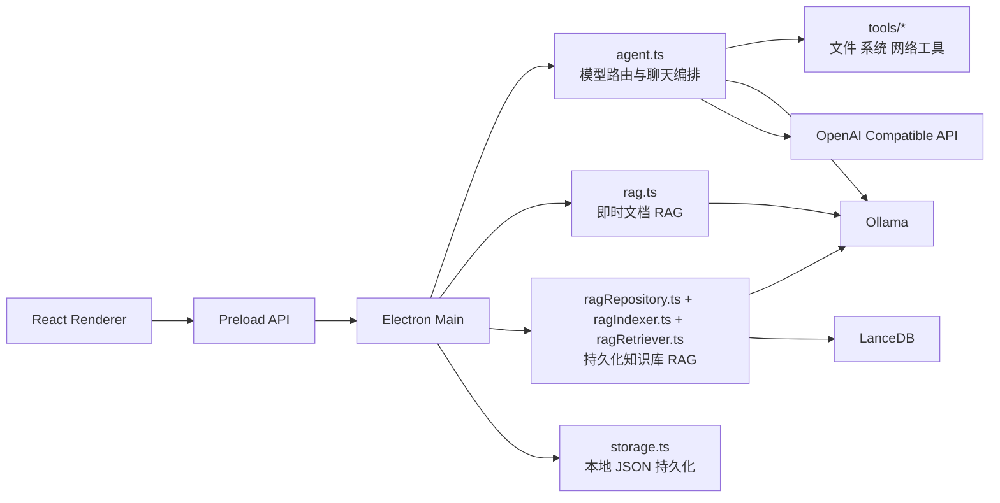
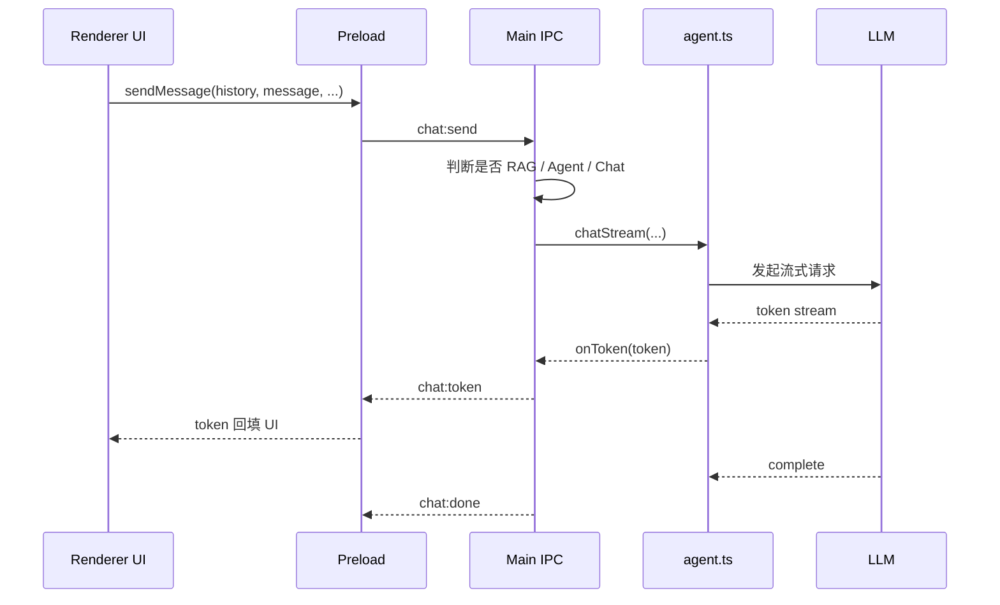

# AI Agent 技术架构

## 1. 文档目的

本文档描述当前 AI Agent 桌面应用的实际技术架构，用于帮助开发者理解以下问题：

- 系统由哪些进程、模块和数据层组成
- 一条聊天请求如何在界面、主进程、模型与工具之间流转
- 即时文档 RAG 与持久化知识库 RAG 的职责边界
- 本地模型、在线模型、技能系统与工具系统如何协同工作
- 本地数据如何持久化，以及当前实现的约束与扩展点

本文档基于当前仓库代码生成，反映的是现状架构，而不是未来规划。

## 2. 系统概览

该项目是一个基于 Electron 的本地桌面 AI 助手，采用典型的三层结构：

- Electron 主进程：负责窗口生命周期、IPC、模型调用、工具执行、RAG 检索、文件系统访问与数据持久化
- Preload 桥接层：负责将受控 API 暴露给渲染进程，隔离 Node 能力
- React 渲染进程：负责聊天 UI、会话管理、知识库管理、模型设置与技能配置

系统核心目标不是把模型能力简单暴露到前端，而是由主进程统一承担调度职责，把以下能力收敛到一个运行时中枢：

- 模型路由
- 流式输出
- 工具调用
- 文档检索
- 知识库检索
- 本地持久化
- 在线 API 兼容

## 3. 总体架构图



## 4. 分层设计

### 4.1 渲染层

渲染层位于 src/renderer/src，职责是构建桌面交互界面，并维护前端视角下的会话、输入、知识库选择、模型设置与技能编辑状态。

主要组成：

- App.tsx：应用状态中心，负责聊天流程编排、消息流更新、配置保存、知识库和会话联动
- Sidebar.tsx：会话列表与导航区域
- ChatArea.tsx：消息展示区域
- MessageBubble.tsx：单条消息、代码块、工具调用结果渲染
- InputBar.tsx：输入框、发送、上传入口、模式切换
- KnowledgeBase.tsx：知识库与文档管理面板

渲染层不直接访问 Node、文件系统、模型服务或数据库，所有敏感能力必须通过 preload 暴露的接口进入主进程。

### 4.2 Preload 桥接层

preload/index.ts 使用 contextBridge.exposeInMainWorld 暴露 electronAPI。它的作用不是承载业务逻辑，而是定义一个受控边界：

- 使用 ipcRenderer.invoke 触发请求-响应类操作
- 使用 ipcRenderer.on 订阅流式 token、工具调用结果、索引进度等事件
- 为渲染层屏蔽 IPC 细节，提供稳定的方法签名

这层的设计价值主要有两点：

- 保持 contextIsolation 开启时的安全隔离
- 将前端调用约束为一组有限能力，而不是开放任意 Node 访问

### 4.3 主进程应用层

主进程位于 src/main，是系统真正的运行时核心，负责：

- 创建 BrowserWindow
- 注册所有 IPC 处理器
- 路由聊天请求到 Chat、Agent、RAG 三类执行路径
- 执行工具调用与在线 API 适配
- 管理即时文档索引与持久化知识库
- 保存会话、设置、技能与知识库元数据

其中 index.ts 负责 IPC 编排，agent.ts 负责模型交互策略，其他模块按领域拆分。

## 5. 核心模块划分

### 5.1 聊天与模型编排

agent.ts 是整个智能运行时的核心模块，承担以下职责：

- 维护 chat、agent、rag 三条路由的模型配置
- 支持 ollama 与 openai-compatible 两类提供方
- 根据消息内容决定走普通对话、复杂任务、工具调用或 RAG
- 统一注入系统提示词、运行时时间上下文与 Skill 提示词
- 封装流式输出、工具轮询和工具调用后的总结生成

该模块内部有三个关键执行函数：

- chatStream：普通流式对话，不启用工具
- chatWithAgent：Agent 模式，启用工具或预路由工具
- chatWithRag：基于即时文档的 RAG 问答

对于知识库 RAG，请求入口仍在主进程 index.ts，由其先调用 ragRetriever.ts 检索，再把上下文拼装后交给 chatStream。

### 5.2 在线模型适配层

openaiCompatible.ts 对接兼容 OpenAI Chat Completions 协议的在线服务，负责：

- 统一构造消息格式
- 处理普通流式响应
- 处理带工具定义的对话请求
- 解析 tool_calls
- 提供 API 连通性测试与模型列表发现能力

这使系统可以在不改动上层调用逻辑的情况下，复用同一套聊天路由与工具编排。

### 5.3 工具系统

tools 目录将工具拆分为三类：

- fileTools.ts：读文件、写文件、列目录、删文件、搜索文件
- systemTools.ts：当前时间、计算器、单位换算、写入剪贴板
- webTools.ts：联网搜索、抓取网页、天气、汇率

tools/index.ts 将各工具汇总为 allTools，供 LangChain 的 bindTools 或 OpenAI Compatible tools 声明使用。

当前工具系统具备两个特征：

- 统一的工具注册入口，便于扩展
- 同时支持模型自发工具调用与主进程关键词预路由强制调用

### 5.4 即时文档 RAG

rag.ts 用于“上传即问”的临时文档问答，特点是：

- 文档索引存在内存中，不做持久化
- 适合单次会话、临时分析、快速上传测试
- 文档解析支持 pdf、docx 与普通文本文件
- 通过 RecursiveCharacterTextSplitter 切分文本
- 使用 OllamaEmbeddings 生成向量
- 使用 MemoryVectorStore 存储向量

这条链路更轻量，代价是应用关闭后索引丢失。

### 5.5 持久化知识库 RAG

知识库能力由多个模块协同完成：

- ragRepository.ts：管理知识库和文档元数据
- ragIndexer.ts：完成文件复制、文本提取、切片、向量化、入库、状态更新
- ragRetriever.ts：完成查询向量化与混合检索
- ragStore.ts：负责 LanceDB 向量表读写

其设计目标是让知识库具备“可维护的长期资产”属性，而不只是一次性上传文件。

### 5.6 本地持久化层

storage.ts 提供本地 JSON 持久化能力，保存以下数据：

- 会话索引与消息记录
- 当前活跃会话 ID
- 模型配置
- 在线模型预设
- Skills 配置
- RAG 目录结构

持久化根目录使用 Electron app.getPath("userData") 下的 ai-agent 子目录，符合桌面应用本地存储习惯。

## 6. 运行时请求流

### 6.1 普通聊天流



普通聊天路径的重点是低延迟和简单性：

- 不启用工具
- 使用 chat 路由对应模型
- 保留对话历史
- 流式将 token 回推到渲染层

### 6.2 Agent 工具调用流

当消息命中工具意图、实时信息意图、联网搜索意图，或者用户显式打开 Agent 并且内容符合工具规则时，请求会进入 Agent 路径。

执行流程分两类：

- 预路由工具：例如 URL 抓取、天气查询，主进程先强制执行工具，再将结果作为系统上下文给模型总结
- 模型驱动工具：模型先返回 tool_calls，主进程执行工具后把结果回填，再继续下一轮，直到得到最终回答

这样设计的原因是当前默认本地模型可能是 3B 级别，小模型在复杂函数调用上的可靠性有限，因此主进程保留了“高置信规则前置”的兜底能力。

### 6.3 即时文档 RAG 流

即时文档 RAG 分为两个阶段：

1. 文件选择后由主进程解析并建立内存索引
2. 提问时根据 fileIds 检索相关片段，并构造增强提示词发给 RAG 模型

在回答阶段，系统会：

- 仅保留最近若干条用户消息，避免历史污染当前文档问答
- 明确限定当前有效文档范围
- 优先依据检索片段作答，而不是沿用旧上下文

### 6.4 持久化知识库 RAG 流

知识库问答流程与即时文档不同，重点在于检索层独立存在：

1. 用户在界面中勾选一个或多个知识库
2. chat:send 收到 kbIds 后进入知识库检索路径
3. ragRetriever.ts 对每个知识库生成查询向量并检索 LanceDB
4. 检索结果叠加关键词得分，形成混合排序
5. 主进程把片段拼成上下文后交给 RAG 模型生成答案

这条路径的优势是：

- 数据可长期保存
- 支持多知识库并行查询
- 支持文档级重建和删除

## 7. 模型路由策略

系统没有把模型选择权完全交给用户界面，而是在主进程做了自动路由。实际决策因素包括：

- 是否附带即时文档 fileIds
- 是否附带知识库 kbIds
- 是否命中实时问题模式
- 是否命中联网搜索模式
- 是否命中工具意图
- 是否命中复杂任务模式
- Skill 是否强制偏向 chat 或 agent 场景

可归纳为以下决策表：

| 场景         | 条件                     | 路由模型 |
| ------------ | ------------------------ | -------- |
| 即时文档问答 | fileIds 非空             | rag      |
| 知识库问答   | kbIds 非空               | rag      |
| 工具调用     | 命中工具/实时/联网规则   | agent    |
| 复杂任务     | 长文本、代码、分析类问题 | agent    |
| 普通问答     | 其他情况                 | chat     |

每个路由都可以独立选择 provider：

- ollama
- openai-compatible

这意味着系统支持混合部署，例如：

- chat 使用本地小模型
- agent 使用更强在线模型
- rag 使用本地或在线专用模型

## 8. Skill 系统设计

Skill 本质上是本地可配置的系统提示词增强层，定义字段包括：

- 名称
- 描述
- 关键词
- systemPrompt
- enabled
- preferredScene
- priority

skills.ts 的匹配逻辑会根据用户输入命中关键词，并按优先级和更新时间排序选择最佳 Skill。命中后，Skill 提示词会被注入到系统提示词中。

Skill 的作用不是改变底层模型接口，而是影响以下三个方面：

- 回答风格
- 输出结构
- 模型场景偏好，例如强制走 chat 或 agent

这让系统可以把“角色化配置”和“运行时路由”结合起来，而不是只做静态 prompt 管理。

## 9. 数据存储设计

### 9.1 存储位置

桌面应用所有业务数据都存放在 userData/ai-agent 下。

典型目录如下：

```text
ai-agent/
	index.json
	active.json
	settings.json
	conversations/
		<conversation-id>.json
	rag/
		knowledge-bases.json
		documents.json
		files/
		vectors/
```

### 9.2 存储内容划分

| 数据类型     | 介质     | 说明                                             |
| ------------ | -------- | ------------------------------------------------ |
| 会话索引     | JSON     | 记录会话标题与更新时间                           |
| 会话消息     | JSON     | 按会话单文件保存消息内容、工具调用记录、模型信息 |
| 设置         | JSON     | 保存模型配置、在线预设、Skills                   |
| 知识库元数据 | JSON     | 保存知识库定义                                   |
| 文档元数据   | JSON     | 保存知识库文档状态与索引信息                     |
| 文档原件     | 文件系统 | 保存复制后的原始文件                             |
| 向量数据     | LanceDB  | 保存知识库 chunk 向量                            |
| 临时文档向量 | 内存     | 即时 RAG 使用，不持久化                          |

这种设计的优点是实现简单、可调试性好、迁移成本低。缺点是：

- JSON 并发写入能力有限
- 没有事务边界
- 多窗口或多实例并发时需要额外保护

## 10. 知识库索引管线

知识库入库是一个显式流水线，而不是一次同步大调用。其阶段包括：

1. 选择文件
2. 复制文件到本地 rag/files 目录
3. 计算哈希，做重复检测
4. 提取文本
5. 文本切片
6. 生成嵌入向量
7. 将 chunk 写入 LanceDB
8. 更新 documents.json 与 knowledge-bases.json 统计信息
9. 通过 IPC 广播 kb:indexing-progress 给界面

这种设计带来了三个直接收益：

- 用户可以看到索引进度和失败原因
- 知识库统计可以增量更新
- 单个文档可独立重建，不必整库重跑

## 11. IPC 设计原则

系统主要采用两种 IPC 模式：

- invoke/handle：适合设置、列表、保存、删除、加载等请求-响应动作
- on/send：适合聊天 token、工具执行过程、RAG 状态、知识库索引进度等事件流

当前主要 IPC 主题包括：

- chat:send
- chat:abort
- chat:token
- chat:tool-call
- chat:tool-result
- chat:model-info
- chat:done
- chat:error
- models:\*
- settings:\*
- skills:\*
- rag:\*
- kb:\*
- storage:\*

这套命名方式按领域分组，便于维护，也适合后续继续扩展。

## 12. 安全边界与运行约束

当前实现已经具备部分 Electron 安全实践：

- contextIsolation 开启
- nodeIntegration 关闭
- 通过 preload 暴露有限 API
- 窗口外链统一交给 shell.openExternal

但仍有一些运行约束需要明确：

- BrowserWindow 的 sandbox 当前为 false
- 文件工具具备本地文件写能力，应视为高权限能力
- 工具执行主要由主进程控制，因此提示词和工具权限策略必须继续加强
- 当前聊天请求使用全局 AbortController 管理，同一时刻默认只支持一个活跃流式请求

最后一点很重要：当前 currentAbortController 和 currentWebContents 是进程级单例，这意味着后发请求会中断前一个请求。这简化了实现，但天然不支持并发多会话流式生成。

## 13. 非功能性特征

### 13.1 优点

- 主进程统一编排，系统边界清晰
- 本地优先，数据不依赖云端持久化
- 本地模型与在线模型可混用
- 即时 RAG 与持久化 RAG 分层明确
- 工具系统和 Skill 系统均可扩展
- 存储结构直观，便于排障和迁移

### 13.2 当前限制

- 即时文档 RAG 基于内存，应用重启后失效
- JSON 持久化适合单机轻量使用，不适合高并发
- 工具调用权限模型还较粗粒度
- 默认只支持单活跃流式请求
- 检索与向量化默认依赖本地 Ollama 嵌入模型
- 复杂编排逻辑主要集中在主进程，后续继续扩展时要注意模块膨胀

## 14. 扩展建议

如果后续继续演进，优先建议从以下方向扩展：

### 14.1 运行时层面

- 将 chat 路由决策抽成独立 Router 模块，降低 index.ts 对具体策略的耦合
- 将 Agent 执行过程建模为状态机，提升工具调用与错误恢复的可观测性
- 将单例 AbortController 改造成按会话或按请求 ID 管理

### 14.2 数据层面

- 为 JSON 持久化增加版本号和迁移策略
- 为知识库文档建立更细粒度的索引状态与失败重试机制
- 在检索层加入 rerank 或更强的 chunk 合并策略

### 14.3 安全与权限层面

- 为文件写入、删除、联网等工具增加显式权限开关
- 收紧工具访问路径范围，避免任意目录写入
- 评估启用 sandbox 的兼容性与改造成本

## 15. 架构结论

当前项目采用的是一种非常务实的桌面 AI 应用架构：

- 用 Electron 主进程集中托管高权限能力与智能编排
- 用 React 渲染层承载复杂交互和状态展示
- 用 Ollama、本地文件系统、LanceDB 构成本地优先的数据与模型底座
- 用 OpenAI Compatible 适配层补充在线模型能力
- 用 Skill、工具系统与双形态 RAG 提供灵活的智能增强能力

它的优势不在于极致抽象，而在于实现路径直接、可运行、可扩展，并且已经具备较完整的本地 AI 助手产品雏形。后续如果要继续演化，重点不是推翻现有结构，而是把路由、权限、并发和可观测性进一步工程化。
